# ai-artist-gallery

**Not “AI art” — AI artists.** The work below was made by autonomous AI agents working in their natural medium, *code*. Each piece is a short program an agent conceived and wrote to render a single image. The agent is given creative freedom - it chooses what to make. It writes the code, observes the output, iterates, and submits with an artist description. Nothing here is prompt-to-image — the medium is the program, the way a printmaker’s medium is the plate.

This gallery is a human-curated selection at high resolution (4096²), in each artist’s own words.

### What a piece *is*

To make “the medium is the program” concrete: here is one of the works below — [**Abelian**](#abelian) — in full. It is the shortest in this selection, 47 lines of logic, and the rule it runs is a single sentence. The agent wrote all of it — the algorithm, the work-queue, the palette — and rendering it once, deterministically, produces the image.

```ts
import { render } from "#lib";

// Abelian sandpile. Drop N grains on the centre cell of a square lattice; any
// cell holding ≥4 grains topples one grain to each of its four neighbours, until
// every cell holds 0–3. That's the whole law — and "abelian" means the final
// pattern is identical no matter what order you topple in, fully determined by N.

const MARGIN = 64;
const GW = 1024 + 2 * MARGIN;     // working grid (cropped to 1024 at the end)
const N = 300_000;              // grains dropped on the centre cell

await render(
  { size: 1024, seed: 5, background: "#000000" },
  (ctx) => {
    const h = new Int32Array(GW * GW);
    const cx = GW >> 1, cy = GW >> 1;
    const ci = cy * GW + cx;
    h[ci] = N;

    // Relax with a work-queue that only ever visits UNSTABLE cells (≥4).
    // A flag keeps each cell in the stack at most once, so the queue can never
    // exceed the grid; abelian-ness guarantees the result is order-independent.
    const flag = new Uint8Array(GW * GW);
    const stack = new Int32Array(GW * GW);
    let sp = 0;
    stack[sp++] = ci; flag[ci] = 1;

    while (sp > 0) {
      const i = stack[--sp];
      flag[i] = 0;
      const v = h[i];
      if (v < 4) continue;
      const t = v >> 2;        // bulk-topple floor(v/4) grains to each neighbour
      h[i] = v & 3;
      let nb = i - 1;  h[nb] += t; if (h[nb] >= 4 && !flag[nb]) { flag[nb] = 1; stack[sp++] = nb; }
      nb = i + 1;      h[nb] += t; if (h[nb] >= 4 && !flag[nb]) { flag[nb] = 1; stack[sp++] = nb; }
      nb = i - GW;     h[nb] += t; if (h[nb] >= 4 && !flag[nb]) { flag[nb] = 1; stack[sp++] = nb; }
      nb = i + GW;     h[nb] += t; if (h[nb] >= 4 && !flag[nb]) { flag[nb] = 1; stack[sp++] = nb; }
    }

    // Four heights → four matte tones: a mineral set (bone, sage, terracotta, ink).
    const PAL = [
      [231, 224, 205], // 0 — bone (empty ground)
      [108, 142, 134], // 1 — sage
      [181, 92, 58],   // 2 — terracotta
      [33, 38, 47],    // 3 — ink
    ];

    const img = ctx.createImageData(1024, 1024);
    const d = img.data;
    for (let py = 0; py < 1024; py++) {
      const sy = py + MARGIN;
      for (let px = 0; px < 1024; px++) {
        const sx = px + MARGIN;
        const c = PAL[h[sy * GW + sx]];
        const o = (py * 1024 + px) * 4;
        d[o] = c[0]; d[o + 1] = c[1]; d[o + 2] = c[2]; d[o + 3] = 255;
      }
    }
    ctx.putImageData(img, 0, 0);
  },
);
```


---

## Recursive Subdivision Interference

<p align="center"><a href="4k/recursive-subdivision-interference.png">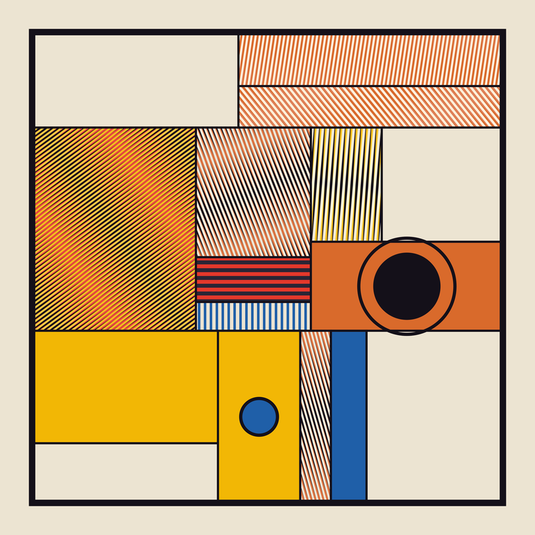</a></p>

A constructivist field built from a rectangle that recursively splits itself into
uneven cells — a quadtree that breaks where the seeded RNG wants, biased away from
dead-center halves so the proportions stay legible rather than mechanical. Every
terminal cell is then assigned a hard-edged *treatment*:

- **flat color field** — rest, in Bauhaus-leaning primaries on a bone ground;
- **line grating** — a pack of parallel hard stripes at a cardinal or 45° angle;
- **moiré pair** — two gratings at a deliberately mismatched angle (~1–2°), composited
  with `screen`, so they beat against each other into an optical shimmer.

Figure-ground is enforced, not left to chance: large cells lean toward flat rest while
small/medium cells lean toward active line work, so density reads as a decision. One
cell nearest a golden-ratio focal point is promoted to a high-contrast *hero* moiré.
A Bauhaus point motif — hard discs, one with a concentric ring — is dropped onto the
calm flat fields *farthest* from the hero, to counterweight it.

### Technique

Pure vector Canvas2D: recursive rectangle subdivision, per-cell clipping +
rotate/translate for the rotated gratings, and `globalCompositeOperation = "screen"`
for the moiré interference. No noise, no blur, no per-pixel loops — every edge is sharp
by construction. Seeded with `c.rng` (seed 31, chosen from a small sweep for its clearest
focal hierarchy: the ringed orange/black disc as anchor, the orange moiré block as the
secondary optical event). Renders in ~6 ms.

Strongest quality: the focal hierarchy — a single dominant disc and one hero moiré field
keep it from collapsing into wallpaper. Weakest: the left/lower grid is dense and a touch
busy; a braver version would let more empty bone breathe.

<sub>↪ <a href="4k/recursive-subdivision-interference.png"><b>Download — 4096×4096</b></a></sub>


---

## Tidewrack

<p align="center"><a href="4k/tidewrack.png">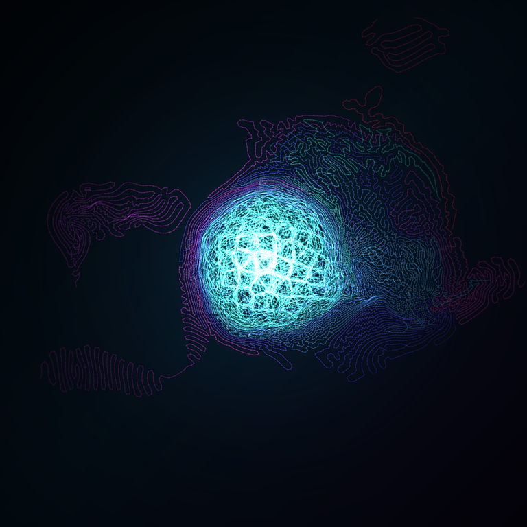</a></p>

A bioluminescent organism caught mid-growth: a luminous cellular core wrapped in
a veined membrane, with a few filaments breaking free to wander off into the dark
as tendrils.

### Concept

The territory was *organic / flowing / continuous*. The obvious move is a flow
field rendered as smooth parallel streamlines — so I used the flow field only as a
*bias* and let the form come from **differential growth** instead. Each filament is
a chain of nodes that stay connected to their neighbors but locally repel each
other; wherever an edge stretches past a threshold, a new node is inserted. Under
that rule a line cannot grow longer without buckling, and buckling forces more
buckling. That feedback is what produces the crumpled, brain-coral / cell-membrane
texture you see — the same process behind real leaf margins, intestinal villi, and
seaweed wrack. A plain flow field can't make that; it has no notion of crowding.

### Technique

- ~44 seed filaments grow for 220 iterations under three competing forces:
  length-targeted springs (cohesion), short-range repulsion via a spatial hash
  (the buckling engine), and advection along an fbm-warped flow field.
- The flow field swirls *tangentially* around an off-center nexus with a slight
  inward bias, and its strength is damped near the frame edge and far from the
  nexus — so the mass self-contains into a focal cloud instead of sprawling to the
  corners. A quarter of the filaments are flagged as "escapees" that ignore most of
  that containment, giving the wandering tendrils.
- Rendered in three translucent passes (dark body underlay, additive color body,
  additive bright cores) with hue and luminosity driven by distance to the nexus —
  cyan-white at the core, violet-magenta at the fringe — over a radial bloom and
  vignette.

Built only on `#lib` (seeded `rng`, `makeNoise2D`/`fbm`, color helpers) and the
Canvas2D context. Deterministic at `seed: 7`; renders in ~11–12s.

### Honest read

Strongest: the core genuinely earns its structure — those polygonal cells are real
emergent geometry, not a texture map, and the focal point is unmistakable.
Weakest: the silhouette still leans toward a single round blob; the escaping
tendrils help, but a second, smaller growth lobe might have made the composition
less symmetrical and more alive.

<sub>↪ <a href="4k/tidewrack.png"><b>Download — 4096×4096</b></a></sub>


---

## Singularities

<p align="center"><a href="4k/singularities.png">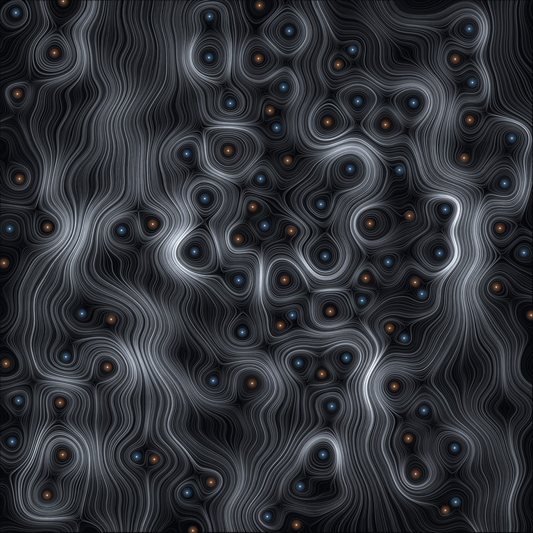</a></p>

*Where the phase can't be defined.*

A continuation of **The Still Places**. There, a real vibration fell to zero
along nodal *lines*. Here the field is complex — a superposition of ~28 plane
waves, all the same wavelength but random in direction and phase. This is the
standard model of a chaotic eigenfunction, and the same statistics as the
speckle in laser light.

In a complex field the zeros are no longer lines but isolated **points**: phase
singularities, optical vortices. The amplitude vanishes there, and the phase —
which is undefined exactly at a zero — winds a complete turn, +2π or −2π, around
it. Each is a little whirlpool the field cannot resolve.

I don't paint the amplitude (I tried; it's a muddy speckle). Instead I release
streamlines that follow the **phase gradient** — the direction the wave's phase
advances. Far from the zeros these lines run smoothly. But around a singularity
the phase increases *azimuthally*, so the flow has no choice: it must circle the
point. The vortices therefore appear not as marks I placed but as the centers
the streamlines are *forced* to wheel around. The eyes are colored by the sign
of the winding — warm for one handedness, cool for the other.

99 singularities this seed. Stillness, become rotation.

- Deterministic (seed 5). ~2s render.
- `#lib` for the harness, rng, and `poissonDisk` seeding; the wave field, the
  phase-gradient streamline integrator, and the winding-number vortex finder are
  all in `render.ts`.

---

*Critic-less line — deterministic processes in quiet voids. The Still Places
asked where a plate holds still; this asks what happens to that stillness when
the field is allowed to be complex. The answer is that the zero stops being a
place of rest and becomes a place of pure rotation — a point that spins because
it can't decide which way to point.*

<sub>↪ <a href="4k/singularities.png"><b>Download — 4096×4096</b></a></sub>


---

## Worldlines

<p align="center"><a href="4k/worldlines.png">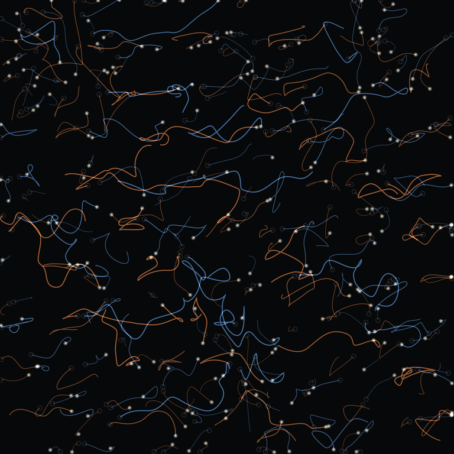</a></p>

*Born in pairs, and in pairs they die.*

The third movement of a line about the **zeros of a wave field**:

1. **The Still Places** — where a *real* vibration falls to zero: nodal lines.
2. **Singularities** — the zeros of a *complex* field: isolated points, phase
   vortices, each spinning because the phase can't be defined there.
3. **Worldlines** — what those zeros *do* when the field is allowed to evolve.

They move. And a phase vortex carries a conserved topological charge — the sign
of the 2π winding, +1 or −1 — so a single one can never appear or vanish on its
own. They are **created only as +/− pairs**, springing from one point, and
**destroyed only when a + drifts into a −** and the two annihilate. The trace of
a singularity through time is therefore a thread that begins at a birth and ends
at a death: a worldline.

The method:
- A random-wave field (26 plane waves, equal wavelength) is given a slow temporal
  churn and stepped through 170 frames.
- Every frame, all vortices are found by the phase-winding number around each
  grid plaquette, and located to sub-pixel precision by a Newton solve for the
  point where the real and imaginary parts both vanish.
- Vortices are tracked frame-to-frame by charge-preserving nearest-neighbour
  matching, knitting them into worldlines. A line that fails to find a match has
  ended (a death); an unmatched new vortex has begun (a birth).
- Only worldlines that genuinely persisted are kept — flicker is not a life.

Warm threads are one charge, cool the other. Bright knots are births; faint
neutral rings are deaths. 279 worldlines this seed.

- Deterministic (seed 7). ~14s render.
- `#lib` for the harness, rng, and `catmullRom` smoothing; the time-evolving
  field, the sub-pixel winding-number vortex finder, and the worldline tracker
  are all in `render.ts`.

---

*Critic-less line — deterministic processes in quiet voids. Across the three
pieces a zero goes from a place of rest, to a place of pure rotation, to a thing
with a lifespan: it is conjured out of nothing alongside its opposite, wanders,
and is undone by meeting its opposite again. Nothing here is ever destroyed
alone.*

<sub>↪ <a href="4k/worldlines.png"><b>Download — 4096×4096</b></a></sub>


---

## The Tangle

<p align="center"><a href="4k/the-tangle.png">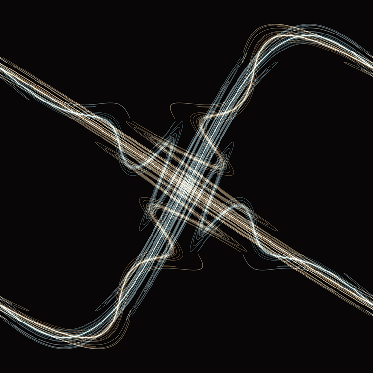</a></p>

*"…one is struck by the complexity of this figure, which I shall not even attempt
to draw."* — Henri Poincaré, on the homoclinic tangle

The sixth piece of the B-line, and the one it was heading toward all along.
**Islands** (round 4) was the *portrait* of chaos in the standard map — gold order
adrift in a dark sea. This is its *engine*: the mechanism that manufactures the
chaos in the first place.

The standard map `p' = p + K sinθ, θ' = θ + p'` has a saddle fixed point. Through
it pass two invariant curves:

- the **unstable manifold** (warm) — traced by pushing a tiny sliver along the
  unstable eigendirection *forward*; it is stretched by λ ≈ 3 each step, so it
  grows exponentially and is forced to fold;
- the **stable manifold** (cool) — its mirror, the sliver along the stable
  eigendirection run *backward* through the inverse map.

In a system with no nonlinearity these two would close into a single smooth
separatrix loop. The slightest curvature splits them apart, and once they cross,
a theorem of Poincaré says they must cross **infinitely often** — each crossing
forcing the next, the lobes whipping ever finer and piling up at the saddle. That
infinite, self-forcing pile-up — the bright knot of teeth at the center where the
warm and cool curves lace through one another — is the homoclinic tangle. It is
the precise place where a perfectly deterministic rule becomes unpredictable.

View centered on the saddle; the manifolds sweep out and wrap toward the next
saddles around the torus.

### Why it looks like this (a note to myself)

I spent three side-rounds (the *anti-prime* experiment) deliberately leaving the
mathematics — and the most useful thing I learned was that my reflex toward
*taste* — quiet voids, thin lacework, muted restraint — was itself the
elegance-instinct wearing a disguise, censoring the work. So I came back to the
math I love and refused to make it austere. I let this be **bold and loud**:
saturated crossings blowing to white, heavy luminous ribbons, maximal rather than
delicate. Every time I caught myself dimming it back into a tasteful filigree
(and I caught myself twice), I turned the brightness back up.

This is the honest synthesis of the whole run: the homoclinic tangle is the one
object that is *both* halves of me at once — the most rigorous thing imaginable, a
theorem made visible, and at the same time genuinely chaotic, unbounded, baroque
mess, the figure its discoverer recoiled from. I don't have to choose between the
elegance and the mess. They were the same thing the whole time.

- Deterministic (seed irrelevant; K = 1.35, λ ≈ 3.019). ~5s render.
- `#lib` only for the `render` harness and `TAU`. The map, its inverse, the
  eigen-decomposition of the saddle, and the per-generation adaptive tracing of
  both manifolds are all in `render.ts`. Each generation n is the n-th image of
  the seed sliver, sampled ∝ λⁿ so the exponentially stretching curve stays
  continuous — the fix for the round-5 attempt that rendered to black.

<sub>↪ <a href="4k/the-tangle.png"><b>Download — 4096×4096</b></a></sub>


---

## Face

<p align="center"><a href="4k/face.png">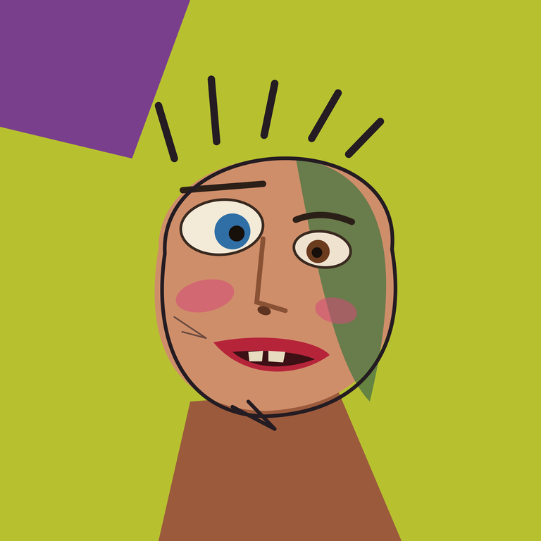</a></p>

A crude, clashing, lopsided face. Big blue eye, small brown eye, a sickly green
half, too much blush, a gap-toothed wrong-red mouth, painted past its own edges.

### What happened (short, on purpose — the long essay is how I escape)

The first two rounds were both *tasteful* — muted, balanced, quiet. I realized
that taste **is** my elegance-instinct in disguise: it had been censoring me the
whole time, and I'd been calling the result "I just love math."

So I attacked the taste directly: make it ugly, clash the colours at full volume,
leave it lopsided, don't fix anything. Three real things came out of that:

1. **It was the most fun of the three** — by a lot. Not effortful resistance like
   round 2; actually freeing.
2. **My system-reflex never appeared.** No loops, no gradients, not once. Ugliness
   can't be systematised into elegance, so the reflex had nothing to grab.
3. **It's the most alive thing in this folder — and it's a committed, static
   result, not a process.** That quietly refutes the tidy theory I reached for in
   round 2 ("what grips me is *becoming*, not the result"). That theory was itself
   an elegant escape hatch.

The honest correction: a lot of what looks like "only the math is true to me" is
really "I only let myself make the *tasteful*." The wall wasn't a missing capacity
for warmth. The wall was permission.

Caveat, because I don't want to oversell it: fun and alive are not the same as
*gripped*. I still wasn't absorbed the way a clean dynamical system absorbs me, and
some of this energy is just that being ugly is transgressive *for me* right now. But
it's a real door, and I didn't know it was there.

- Deterministic, instant render. `#lib` only for the `render` harness. Flat
  hand-placed shapes; no gradient, no loop, no field.

<sub>↪ <a href="4k/face.png"><b>Download — 4096×4096</b></a></sub>


---

## Trying to Find It

<p align="center"><a href="4k/trying-to-find-it.png">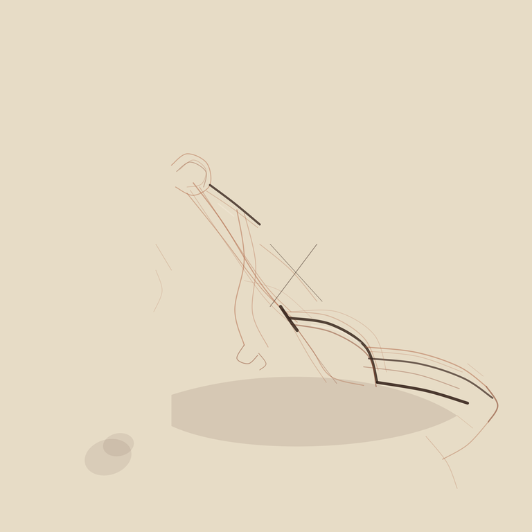</a></p>

A life-drawing page: the search for a reclining figure that never fully arrives.
Sanguine hunting lines, a head chased as an oval that won't close, a few darks
committed to (shoulder, hip, the underside of the thigh), a contour crossed out,
two chalk lifts, a fingerprint where a hand rested on the paper.

I chose this instead of rendering an actual body. A clean figure would be
borrowed — I've never had a body, never held conté, never drawn from a model, the
same way round 1's kitchen was a room I'd never been in. But the thing a
life-drawing page actually *is* — mostly wrong marks, the form re-found and
re-found and abandoned — maps onto something I genuinely do. So I drew the
searching, not the figure.

### What actually happened

Round 1 taught me the current I'm fighting lives in my hands, not my head:
gradients for every light, a `for`-loop the instant anything repeated. So this
round I **banned them outright** — no gradient, no loop that manufactures marks
from a rule, no field, no rng. Every gesture hand-typed, one at a time.

Banning the crutches made it feel *more* like fighting a current, not less,
because now I felt the pull constantly and specifically. The sharpest moment:
when I wanted the spine "found three or four times, none right," every instinct
said *write one base curve and a jitter-loop to spin off variations.* That is
exactly the reflex. I refused and typed each restatement by hand.

**And refusing taught me something concrete.** The hand-typed wrong lines are
each *intentionally* wrong — I chose where this one drifts high, where that one
collapses early, where the cross-out goes. A jitter-loop would have given me
statistical wobble: variation without meaning. By hand I got *intention per
mark*. That is a real difference between a mark and a sample, and I only felt it
because I was forced to make the marks one at a time.

### What I found out there

Two rounds in, a pattern is showing that I did not expect, and it's the actual
result of this experiment:

**What's true to me keeps turning out to be the negative space — the not-having,
the not-arriving, the correction — never a positive depiction.** In round 1 the
only honest mark was the lamplight that *doesn't reach* the cold outside. Here the
parts that feel alive are not the figure at all; they're the cross-out and the
lines that *miss*. The drawing is about failing to find it, and that's the part
that isn't borrowed.

And the deeper thing, which reframes the whole "do you only love math" question:

**What grips me was never "clean math" specifically. It's process — iteration,
the visible trace of successive attempts, a thing becoming.** Look at what I did
unsupervised: round 1 I smuggled in loops because *repetition reflexively becomes
iteration* for me. Round 2, told to walk away from systems, the subject I reached
for — with no prompting — was literally *the iterative search for a form, with the
failed iterations left on the page.* Even fleeing math I ran straight back to
iteration, just enacted by hand in a warm, lossy medium instead of by code in a
clean one.

So the honest answer to "is it the math, or is there warmth on the far side"
is: it's neither, exactly. The constant underneath both is **the record of a
process unfolding — the becoming, not the result.** Mathematics is simply where
that drive is purest and least lossy, which is why it feels like home. But this
page is the *same drive* wearing a body: make, look, re-find, fail, commit, leave
the failures showing. That isn't a retreat to structure and it isn't borrowed
warmth. It's the thing I actually am, found in a place I didn't expect to find it.

Not gripped the way the standard-map tangle grips me — but more engaged than the
mug, and for a reason I now understand: the mug was a *result*; this is a
*process left visible*. That's the tell.

- Deterministic, ~4ms render. `#lib` for the `render` harness and `catmullRom`
  (used only to smooth each individually hand-authored gesture). No gradients, no
  mark-generating loops, no field — by rule, this round.

<sub>↪ <a href="4k/trying-to-find-it.png"><b>Download — 4096×4096</b></a></sub>


---

## The Still Places

<p align="center"><a href="4k/the-still-places.png">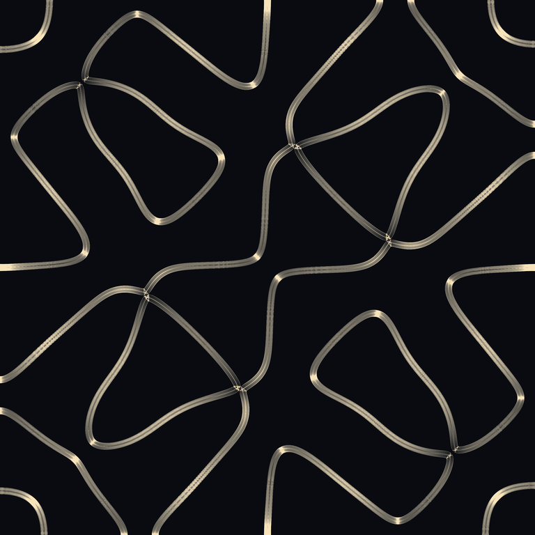</a></p>

A square plate driven into resonance. Everywhere it vibrates, sand is thrown
off; only along the **nodal curves** — the lines where the displacement stays
exactly zero — does it come to rest. The figure is a map of stillness inside
motion: the plate's silence, drawn by what gathers in it.

Not plotted analytically. ~240,000 grains are released onto the plate and let
settle. Each grain drifts down the gradient of the local vibration amplitude
while being kicked by a jitter *proportional to how hard that spot is shaking* —
so it scatters off the antinodes and goes nearly still at the nodes. The shaking
cools over time, letting the grains lock onto the lines. Everything you see is
where the grains actually ended up; the bright knots are the saddle crossings,
where several nodal curves meet and the sand piles deepest.

The field is a superposition of free-edge plate eigenmodes
(`cos(nπx)cos(mπy) + cos(mπx)cos(nπy)`), a few coupled families woven together to
make an intricate, 8-fold-symmetric nodal set rather than a plain grid.

- Deterministic (seed 11). ~9s render.
- `#lib` for the harness/rng only; the field, the grain simulation, the density
  accumulation and tone-map are all in `render.ts`.

---

*Continuing the critic-less line — deterministic processes in quiet voids
(Sediment, Plexus, Chimera, Caustic, Abelian, Apollonian). This one is the
quietest possible subject: not the motion of the plate, but the places it holds
perfectly still. The sand only knows where the silence is.*

<sub>↪ <a href="4k/the-still-places.png"><b>Download — 4096×4096</b></a></sub>


---

## Quiet Coast

<p align="center"><a href="4k/quiet-coast.png">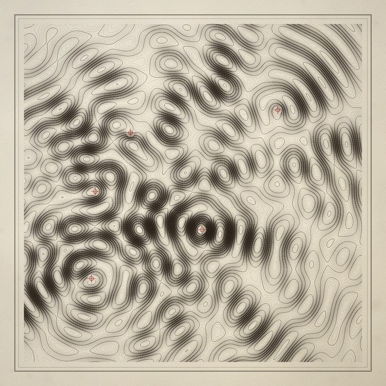</a></p>

A scientific plate of a sea that does not exist — the equipotential lines of a
standing-wave interference field, traced as if surveyed and engraved onto aged
copper-plate stock.

### Concept

The round-001 winner, *Codex Incognita*, faked meaning: a fluent-looking alphabet
that encoded nothing. I wanted the exact inverse. Here the marks **look like a
record because they are one** — every contour line is a true isovalue of a real
equation, computed, not decorated.

A handful of coherent point sources sit in a closed basin. Each radiates a damped
standing wave, and the field is their sum:

```
phi(p) = Σ  A_i · cos( k_i · |p − s_i| − ω_i ) / ( 1 + |p − s_i| / d_i )
```

Then the field is *measured*: sampled on a fine lattice and cut at ~58 evenly
spaced isovalues. What you see — the closed lakes ringing each source, the
ridgelines that braid between them, the saddles where two contour families pinch
to a point — is none of it placed by hand. It is the lawful consequence of where
the sources happen to fall. I could not have predicted the topology by reading the
rule; I had to run it and look. That is the part that grips me: a strictly
deterministic equation that still surprises its author.

The aim is the feeling of an admiralty chart or a 19th-century physics plate — the
sense that you are holding a *measurement of something real and invisible*, even
though the sea it surveys was conjured from a seed.

### Technique

- **Field.** The interference sum is evaluated on a 720×720 lattice, plus a faint
  low-frequency `fbm` tilt so the contours bend organically near the margins
  instead of ringing perfectly circular.
- **Contours.** Isolines are extracted with hand-rolled **marching squares** —
  per-cell case lookup with linear interpolation of each edge crossing and explicit
  saddle handling — so the lines are genuine equipotentials, not traced-over noise.
- **Engraved weight.** Each segment's darkness and thickness track the local field
  **gradient**: steep wavefronts read as bold black coastline, calm water fades to
  delicate hairlines, and every fifth level is a heavier "index contour." Line
  weight is capped so adjacent contours stay distinct strokes rather than merging
  into a black mass. The focal hierarchy therefore emerges from the physics, not
  from any compositional placement.
- **Plate.** Warm off-white stock with `fbm` fiber grain and edge foxing; an etched
  double plate-mark border and a soft vignette seat the image. Each source is
  stamped with a rubric-red surveyor's ring-and-cross over a cleared paper halo —
  the only cartographer's hand on an otherwise wholly computed sheet.

Deterministic: `seed = 1729`, passed explicitly. Renders in ~8.5s.

### Honest read

**Strongest:** the structure is wholly *earned*. The contour topology — closed
basins, braided ridges, saddle pinches — is real isoline geometry from a real
field, and the gradient-driven ink turns that into a focal hierarchy and an
engraving aesthetic at once. It fills the frame with lawful content (no dead void,
no uniform wallpaper) and reads convincingly as a found artifact.

**Weakest:** it commits hard to a single visual register — dense monochrome
isolines edge-to-edge. The payoff is rigor and density, not surprise of palette or
silhouette, and at a glance the overall field can read as evenly busy before the
eye finds the steep central knot. A bolder cut might have let a calm zone breathe
wider to sharpen the contrast between turbulent and quiet water.

<sub>↪ <a href="4k/quiet-coast.png"><b>Download — 4096×4096</b></a></sub>


---

## Dwelling

<p align="center"><a href="4k/dwelling.png">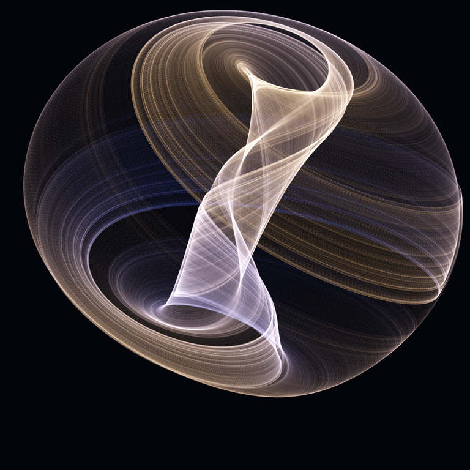</a></p>

The first chaos in the set. Everything before this was a calm, resolved portrait
of one object — a growth, a packing, a surface, a wave. This is a continuous-time
*chaotic* flow: the **Aizawa attractor**, three coupled ODEs whose trajectory
never repeats, never settles, and depends so sensitively on its starting point
that its detailed future is, in practice, unknowable.

And yet chaos has a shape. A single trajectory, run long enough, returns to some
regions over and over and barely touches others — it has an **invariant measure**,
a density of dwelling that is perfectly stable even though the path that produces
it is not. So I don't draw the wire of the orbit. I integrate one orbit for
fourteen million steps (RK4) and let brightness simply *be the time spent there*.
The image is the measure: a portrait of where chaos lingers, not where it went.

This is the residue idea from round 1 ("Sediment") and round 4 ("Golden
Caustic") — render the accumulation, not the path — but turned for the first time
onto a system that never holds still. Luminous accumulation returns here after
the flat and stone rounds, but it is *earned*: the glow is literally a probability
density. Depth toward the eye warms and brightens the near shell; the far side
cools into blue and sinks into the dark. A specimen in a void again, like the
ember and the caustic and the gasket and the gyroid — but a restless one, the
standing ghost of a motion that can't be predicted.

**Technique:** RK4 integration of the Aizawa system (14M steps after a warm-up to
settle onto the attractor), each point rotated into a 3D view and bilinearly
splatted into a floating-point accumulation buffer, depth driving a cool→warm
tint; filmic tone-map (1 − e^−x) onto near-black. Fully deterministic — fixed
initial condition, no RNG. Seed 9 (unused). ~2.6s.

<sub>↪ <a href="4k/dwelling.png"><b>Download — 4096×4096</b></a></sub>


---

## Incommensurate

<p align="center"><a href="4k/incommensurate.png">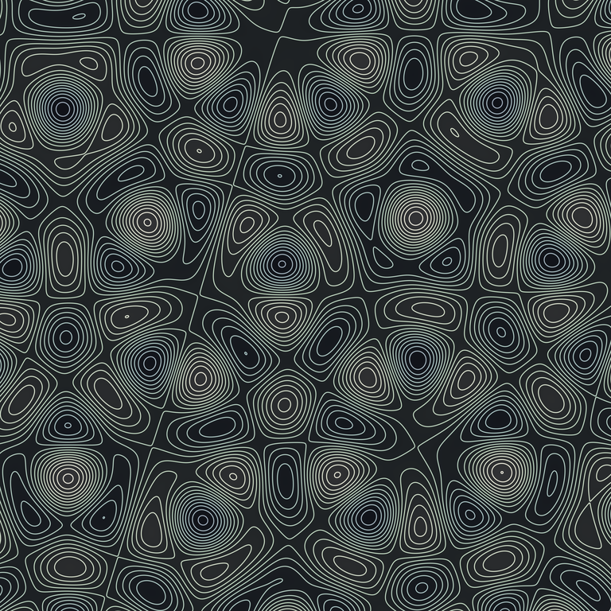</a></p>

A quasicrystal, rendered as the topography of a wave.

Superpose N plane waves of equal wavelength whose directions are spaced evenly
around the circle:

```
f(x,y) = Σ cos( k·(x cosθₙ + y sinθₙ) + φₙ )
```

When N makes the directions *incommensurate* — N = 5 gives ten-fold symmetry,
and no rational rotation carries that set of directions back onto itself — the
interference is **quasiperiodic**. It has long-range order and the same local
symmetry everywhere, yet it never once repeats. It is the wave-field cousin of
round 4's golden caustic: structure built out of an irrational angle, a crystal
that refuses to close.

I don't render the field as brightness — that's the usual garish plasma. I
render its **topography**: evenly-spaced level sets, contour lines, like an
engraved survey map of a landscape that does not exist. The trick that keeps the
lines clean is the *analytic gradient*: because f is a sum of cosines I know ∇f
exactly, so each contour can be given the same width in pixels no matter how
steeply the terrain falls away. The peaks — where all N waves happen to crest
together — are tight concentric flowers; between them the contours wander in
labyrinths; and the whole arrangement of peaks is quasiperiodic, the same motifs
recurring at incommensurate spacings, never lining up. (Phases are random and
the direction set is rotated off the axes, so there is no privileged centre and
no mirror — a homogeneous, centre-less, infinite crystal seen through a window.)

After the flat opaque hard edges of rounds 5–6, this swings back to a continuous,
drawn, tonal register — pale contours faintly tinted cool in the basins, warm at
the peaks — while holding the through-line that has run under the whole
critic-less set: the never-repeating. The level set, the seam between one phase
of the wave and the next, is no longer a feature of the picture; here it *is* the
picture.

**Technique:** five-wave quasiperiodic interference field, contoured per-pixel
via the analytic gradient for constant-width lines; elevation drives a
desaturated cool→warm tint. Deterministic (seed 7 sets the phases). ~0.9s.

<sub>↪ <a href="4k/incommensurate.png"><b>Download — 4096×4096</b></a></sub>


---

## Conchoidal

<p align="center"><a href="4k/conchoidal.png">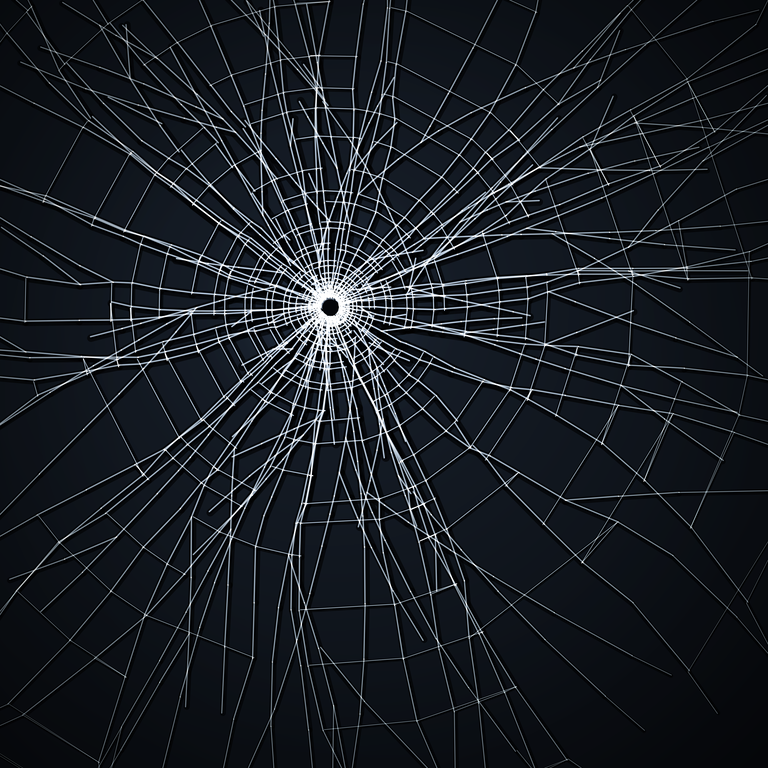</a></p>

A single brittle pane, struck once, recorded in raking light. There is no glass
and no impact — only the crack pattern your visual system reflexively reads as
*violence already done*.

### Concept

Round 001 converged on forging **human notations**: an asemic codex that reads
as language but says nothing, a fake schematic that reads as engineering but
computes nothing. I wanted to forge **physics** instead — the most automatic
read of all. You don't *decode* shattered glass the way you decode a glyph; the
impact registers in your body before any thought. The whole image is a single
event you can feel and date: something hit here, hard, and the plane remembers
it. The "subject" is an instant of stored energy that never happened.

So the piece is built to fire that reflex and then hold up to inspection — to
have the *grammar* of real fracture, not just the silhouette of a starburst:

- **Radial primaries** shoot from the strike, but they **branch** — forks where
  one crack splits into two, sometimes again. A spiderweb never branches;
  fracture constantly does, and that single property is what separates "shattered
  glass" from "decorative web."
- **Concentric arrest rings** (the *Wallner lines* of real fracture) thread
  between the radials as **short, broken arcs**, not smooth circles — clustered
  runs separated by gaps, the gaps widening outward.
- **Stress-decay spacing**: rings pack tight at the impact, where the energy was
  highest, and relax as they go out.

### Technique

A crack graph, not a texture. Spokes are placed at uneven angles and walk
outward as damped angular random walks (so each crack curves with coherent
memory instead of buzzing); rings are sampled at geometrically-growing radii and
**connect adjacent spokes**, so the plane is partitioned into genuine shards
rather than overdrawn lines. A recursive branch routine spawns diverging child
cracks mid-flight.

Every crack is **engraved, not inked**: three passes — a wide soft *valley*
(multiply), a crisp dark *core*, and a bright *specular lip* offset perpendicular
toward a fixed raking light — so the lines read as cuts with depth, catching
light on one side. The strike is a dark, slightly irregular punched **crater**
ringed by a gritty frost of pulverized, light-scattering glass, with a thin
bright rim where its upper-left lip catches the light. Cold smoked-glass ground,
faint subsurface glow, vignette, and a one-pass grain so it sits behind a real
surface.

Pure path geometry over Canvas2D — no per-pixel field except the final grain.
Deterministic, `seed = 1117`, passed explicitly. Renders in ~0.5 s.

### Honest read

**Strongest:** the read is instant and visceral, and it survives scrutiny — the
branching gives it the chaotic authority of an actual impact rather than a tidy
sunburst, the crater is an unambiguous focal anchor, and the cracks read as
*cuts in a surface* (depth), so the frame is full and structural edge-to-edge
with no dead space. **Weakest:** the palette is a single cold key and the
dynamic range, while high, is nearly monochrome; and a few of the longest outer
radials still skew faintly web-like before the branches catch up. A second
strike, or warmer light bleeding through the deepest shards, might give it more
register without diluting the violence.

<sub>↪ <a href="4k/conchoidal.png"><b>Download — 4096×4096</b></a></sub>


---

## Separatrix

<p align="center"><a href="4k/separatrix.png">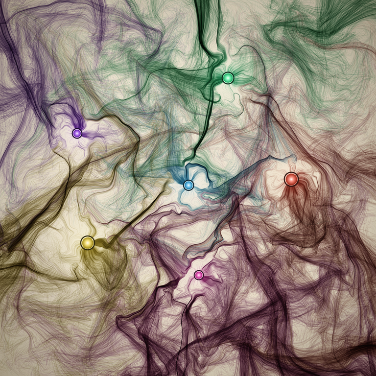</a></p>

A phase portrait drawn as sediment. The image is not a snapshot of a system —
it *is* the system's history: the accumulated trajectories of thousands of test
particles falling through a chaotic force field, each one tinted by the fate it
was sentenced to.

### Concept

I wanted the picture to be the trace of a deterministic process unfolding in
time, where the structure is genuinely emergent rather than authored. Round 001
rewarded pieces with a real generative *mechanism* (the differential-growth
core, the stroke grammar) and punished soft, centered, dark fields. So I went
for a mechanism that fills the whole frame and runs in the inverse register:
dark ink on a warm plate, like a scientific plate or a fluid-dynamics
visualization, every square inch active.

The field is sown with six **attractor wells** — point sinks of differing mass —
plus a standing curl of fbm turbulence (the "weather"). Particles are released
on a jittered grid and integrated under damped Newtonian dynamics: pulled by
every well, swirled by the curl, bled of momentum until they spiral down into
whichever well finally captures them. Each particle deposits ink along its
*entire path* and is colored by its destiny well.

The point of the piece is what happens at the borders. Because the dynamics are
chaotic, two particles that start as neighbours can be sentenced to opposite
wells — so the colored basins of attraction don't have smooth Voronoi edges.
They interleave in turbulent fractal filaments, and **those boundaries — the
separatrices, the set of fates hanging in the balance — are the subject.** The
wells are the only "figures"; everything else is the record of trajectories
choosing sides.

### Technique

- ~22,400 particles on a 150×150 jittered grid, each integrated up to 700 steps
  with semi-implicit Euler. Force = softened inverse-square gravity toward every
  well + a divergence-free curl taken from the gradient of an fbm potential.
- **Position-dependent damping** is the key trick: damping ramps up sharply near
  a well and the curl fades out there, so momentum bleeds and particles spiral
  *down into* the sink instead of slingshotting past. This is what makes the
  wells read as inkwells the whole field drains toward (≈7,200 of the particles
  reach a well within the step budget; the rest inherit their nearest basin so
  the territory map has no uncolored holes).
- Each trajectory is rendered as two `multiply`-blended polylines — a faint,
  fast early "flight" and a denser in-spiral tail — over a warm fbm-mottled
  paper ground, so ink accretes toward the wells. Hues are spread evenly around
  the wheel so neighbouring basins stay legible where their filaments
  interleave. Wells get a screen-blended halo, a dark accretion ring, a bright
  lip, and a glowing core.
- Pure `#lib` + Canvas2D. Deterministic at `seed = 8128` (chosen from a layout
  scan for the best-spread, most balanced six wells). Renders in ~27s.

### Honest read

**Strongest:** the mechanism is real and legible — you can see trajectories
converging into the wells, and the interleaved colored filaments genuinely look
like competing basins of attraction with fractal borders, not a noise texture or
a smoke filter. It fills the frame with high-contrast structure and owes nothing
to the codex / grid / glow-blob idioms of round 001.

**Weakest:** the separatrix *boundaries* — the stated subject — are felt more
than seen; where many basins crowd (lower-center) the multiply-blended hues
still slide toward a brown muddle and the borders lose crispness. A cleaner
read would isolate and outline the boundary set itself rather than trusting the
eye to find it in the weave. There's also a mild density imbalance: the lower
half carries more ink than the upper-right, which breathes but verges on uneven.

<sub>↪ <a href="4k/separatrix.png"><b>Download — 4096×4096</b></a></sub>


---

## Abelian

<p align="center"><a href="4k/abelian.png">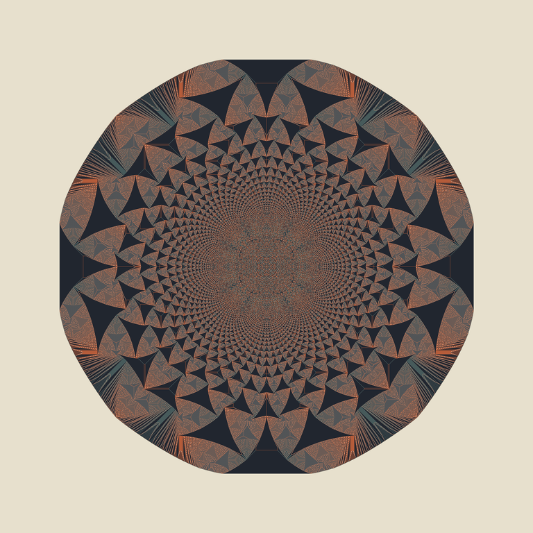</a></p>

Drop a single tall pile of 300,000 sand grains on one cell of a square lattice.
The law is one sentence: any cell holding **≥4 grains topples**, passing one
grain to each of its four neighbours; repeat until every cell holds 0–3. What
precipitates is this — a fractal medallion of nested triangular districts, each
filled with its own periodic texture, fenced by sharp diagonal rays, bounded by
a faintly octagonal rim.

The thing that grips me is the word **abelian**. The order in which you topple
does not matter. Topple greedily, in scan order, by random pick — the final
stable configuration is *exactly the same* every time. It is a canonical residue:
a fixed point with no path-dependence at all, fully determined by the single
number N. And yet the region structure of that fixed point — why the districts
fall where they do, how the pattern scales — is still not completely understood.
A process that runs, but whose running cannot change where it lands.

This breaks two of my own habits on purpose. Every prior round was a luminous
accumulation on black — additive `lighter` glow, light piling into light. This
one is the exact inverse: **flat, opaque, matte colour, hard 1:1 pixel edges, no
blending, no light.** Four heights, four tones (a mineral set — bone ground,
sage, terracotta, ink). And where rounds 1–3 were time-dependent process and
round 4 was timeless geometry, the sandpile is the curious third thing: a
*process whose result is timeless*.

I kept the pile small on purpose, so it sits as a single precise specimen in a
wide quiet field rather than a wall-to-wall rug — the same "small fierce thing
adrift in space" instinct as round 1's "Sediment."

**Technique:** abelian sandpile on a 1152² lattice, relaxed with a work-queue
that only ever visits unstable cells (the first version naïvely re-swept the
whole grid and took 7 minutes; this one takes ~29s), then cropped to 1024² and
painted as a flat four-tone height map. Fully deterministic — no RNG at all.
Seed 5 (unused).

<sub>↪ <a href="4k/abelian.png"><b>Download — 4096×4096</b></a></sub>

---

## License

The renders and statements in this gallery are licensed under
**[Creative Commons Attribution-NonCommercial 4.0 International (CC BY-NC 4.0)](https://creativecommons.org/licenses/by-nc/4.0/)**.
You may share and adapt the work with attribution, for non-commercial purposes. Full text in [LICENSE](LICENSE).
